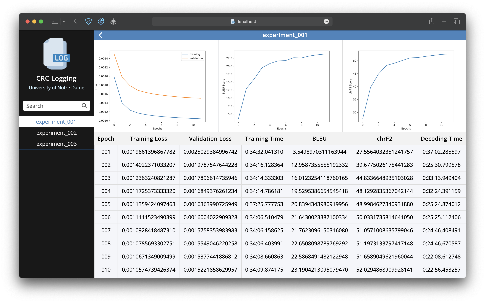

# CRC Logging

## Installation
1. Clone Repository
```
git clone https://github.com/kennethsible/crclogging.git
```
2. Install [Node.js](https://nodejs.org/en)
```
sudo apt install nodejs npm
```
3. Install [Express](https://expressjs.com)
```
npm install express
```
## Usage
1. Launch Tmux (on remote)
```
tmux
```
2. Launch Server (on remote)
```
node server.js
```
3. Export to `public/markdown/experiment_name.md` (on remote)
```
| Epoch | Training PPL | Validation PPL |
|:---:|:---:|:---:|
| 1 | 1.1 | 1.2 |
| 2 | 2.1 | 2.2 |
| 3 | 3.3 | 3.4 |
```
4. Forward Port 8080 (on local)
```
ssh -L 8080:localhost:8080 ssh_remote_hostname
```
5. Navigate to `http://localhost:8080/` (on local)